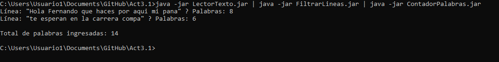

# 📖 Act3T1PSP

Este repositorio contiene **tres proyectos Maven independientes**, cada uno con su propia clase principal compilada en un archivo **JAR ejecutable**.  
Los proyectos pueden ejecutarse en **cadena usando tuberías en la terminal de Windows**, lo que permite procesar texto de manera secuencial sin archivos intermedios.  

---

## 📂 Contenido del repositorio

- 📥 **LectorTexto** → Lee líneas de texto ingresadas por el usuario.  
- 🧹 **FiltrarLineas** → Filtra las líneas de texto que cumplan ciertas condiciones o formato.  
- 🔢 **ContadorPalabras** → Cuenta las palabras de cada línea y muestra un total acumulado.  

Cada proyecto genera su propio archivo JAR:

- `LectorTexto.jar`  
- `FiltrarLineas.jar`  
- `ContadorPalabras.jar`

---

## ❓ ¿Qué son las tuberías?

Las **tuberías** (`|`) permiten que la salida de un programa se use como entrada de otro.  

En este proyecto el flujo es:  

```
📥 LectorTexto → 🧹 FiltrarLineas → 🔢 ContadorPalabras
```

Esto hace que todos los programas trabajen de forma **secuencial**, sin necesidad de crear archivos temporales.

---

## ▶️ Ejemplo de ejecución

En la terminal de Windows, dentro del directorio donde se encuentran los JARs:

```bash
java -jar LectorTexto.jar | java -jar FiltrarLineas.jar | java -jar ContadorPalabras.jar
```

### 📌 Ejemplo de salida real

```
línea: "Hola Fernando que haces por aqui mi pana" ? Palabras: 8
línea: "te esperan en la carrera compa" ? Palabras: 6

Total de palabras ingresadas: 14
```

---

## 📸 Captura de ejecución

Aquí la prueba de haberlo ejecutado en la terminal 👇  



---

## 📄 Archivo de entrada de ejemplo

Dentro del proyecto **LectorTexto**, en la carpeta de recursos, se incluye un archivo de ejemplo llamado:
```
LectorTexto/src/main/resources/entrada.txt
```

### Contenido de `entrada.txt`

```txt
Hola Fernando que haces por aqui mi pana
te esperan en la carrera compa
vente rey
```

Este archivo sirve como ejemplo de entrada para probar la ejecución en cadena con los otros módulos.
---
## ⚙️ Cómo usarlo

1. Clona el repositorio:
   ```bash
   git clone https://github.com/JotaMynds/Act3T1PSP.git
   ```

2. Abre cada proyecto Maven en tu IDE favorito y compílalo para generar los JARs en la carpeta `target`.

3. Ejecuta los JARs en cadena con tuberías como en el ejemplo.

---

## 🚀 Funcionalidades

✅ Lectura de texto desde la terminal.  
✅ Filtrado de líneas según criterios definidos en **FiltrarLineas**.  
✅ Conteo de palabras por línea y total acumulado en **ContadorPalabras**.  

---

## 📝 Notas

- ⚡ Diseñado para ejecutarse en **Windows** usando tuberías en `cmd` o `PowerShell`.  
- 🐧 También es compatible con **Linux/Mac**, ya que el uso de tuberías es estándar.  

---
